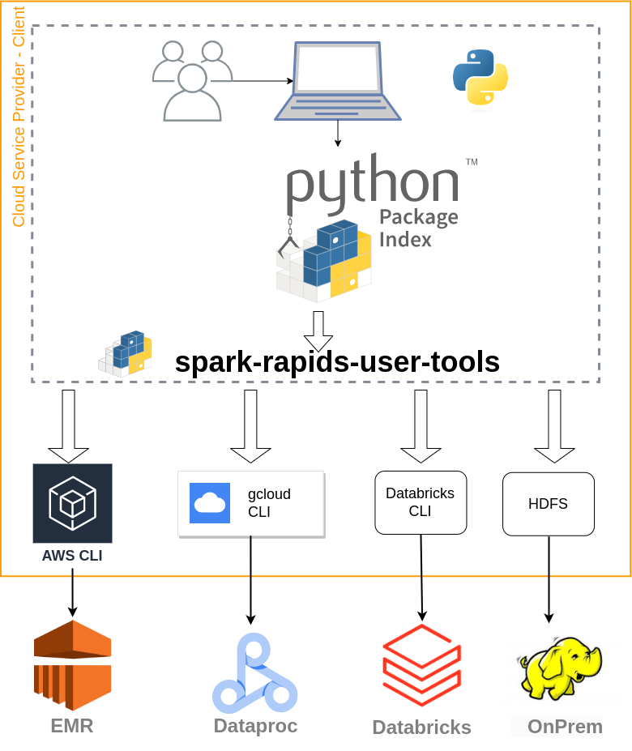

# spark-rapids-user-tools

Installing the Python wrapper ([spark-rapids-user-tools](https://pypi.org/project/spark-rapids-user-tools/))
on a client machine, provides a runtime environment that simplifies running cost and performance
analysis using the RAPIDS Accelerator for Apache Spark across multiple cloud service providers.

The following diagram shows an overview of the Python package installed on a client machine allowing
to build analysis reports on Amazon EMR, GCloud Dataproc, and Databricks.



## Available commands

### Qualification

Provides a wrapper to simplify the execution of [RAPIDS Qualification tool](../../core/docs/spark-qualification-tool.md)
The latter analyzes Spark events generated from  CPU based Spark applications to help
quantify the expected acceleration and costs savings of migrating a Spark application or
query to GPU.  

The tool will process each app individually, but will group apps with the same name into the same output row after
averaging duration metrics accordingly.
For more details, please visit the
[Qualification Tool on GitHub pages](https://nvidia.github.io/spark-rapids/docs/spark-qualification-tool.html).

### Bootstrap

Provides optimized RAPIDS Accelerator for Apache Spark configs based on GPU cluster shape.
This tool is supposed to be used once a cluster has been created to set the recommended configurations.  The tool
will apply settings for the cluster assuming that jobs will run serially so that each job can use up all the
cluster resources (CPU and GPU) when it is running.

Note that the command may require `SSH` access on the cluster nodes to read the GPU settings and to update
Apache Spark default configurations.

### Profiling

Provides a wrapper to simplify the execution of [RAPIDS Profiling tool](../../core/docs/spark-profiling-tool.md).
The latter analyzes both CPU or GPU generated event logs and generates information which
can be used for debugging and profiling Apache Spark applications.  The tool also will recommend setting
for the application assuming that the job will be able to use all the cluster resources (CPU and GPU) when
it is running.

In addition, the wrapper output provides optimized RAPIDS configurations based on the worker's
information.  

For more details, please visit the
[Profiling Tool on GitHub pages](https://nvidia.github.io/spark-rapids/docs/spark-profiling-tool.html).

### Diagnostic

Collect proper information from Spark cluster and save to an archive for troubleshooting, such as OS version,
number of worker nodes, Yarn configuration, Spark version and error logs etc.

Note that the command would require `SSH` access on the cluster nodes to collect information otherwise error would
be raised.

## Deploy modes

The wrapper has the following deployment modes:

1. **local**: The wrapper runs a Java application on the local dev machine. This mode requires the following:
   1. The cloud SDK is installed and configured correctly to access the resources such as event logs.
   2. Java 1.8+ development environment
   3. access to maven repositories to download dependencies such as Spark 3.x.
2. **cluster**: The wrapper submits a job to an existing cluster. Note that the _Bootstrap_ tool can
   only run in this deployment mode.  This deployment mode requires the following:
   1. The cloud SDK is installed and configured correctly to access the resources such as event logs.
   2. An active cluster is running before issuing the wrapper command.
   3. The active cluster is running Spark 3.x


## Supported platforms

The following table summarizes the commands supported for each cloud platform:

```
+------------------+---------------+-------------+-----------------------------------------+----------+
| platform         | command       | deploy mode |              CLI                        |  version |
+==================+===============+=============+=========================================+==========+
| EMR              | qualification | local       | spark_rapids_user_tools \               |  23.02+  |
|                  |               |             |   emr qualification [ARGS]              |          |
|                  |               +-------------+-----------------------------------------+----------+
|                  |               | cluster     |           unsupported                   |    N/A   |
|                  +---------------+-------------+-----------------------------------------+----------+
|                  | profiling     | local       |           unsupported                   |    N/A   |
|                  |               +-------------+-----------------------------------------+----------+
|                  |               | cluster     |           unsupported                   |    N/A   |
|                  +---------------+-------------+-----------------------------------------+----------+
|                  | bootstrap     | local       | spark_rapids_user_tools \               |  23.02+  |
|                  |               |             |   emr bootstrap [ARGS]                  |          |
|                  |               +-------------+-----------------------------------------+----------+
|                  |               | cluster     | spark_rapids_user_tools \               |  23.02+  |
|                  |               |             |   emr bootstrap [ARGS]                  |          |
|                  +---------------+-------------+-----------------------------------------+----------+
|                  | diagnostic    | local       |           unsupported                   |    N/A   |
|                  |               +-------------+-----------------------------------------+----------+
|                  |               | cluster     | spark_rapids_user_tools \               |  23.06+  |
|                  |               |             |   emr diagnostic [ARGS]                 |          |
+------------------+---------------+-------------+-----------------------------------------+----------+
| Dataproc         | qualification | local       | spark_rapids_user_tools \               | 23.02.1+ |
|                  |               |             |   dataproc qualification [ARGS]         |          |
|                  |               +-------------+-----------------------------------------+----------+
|                  |               | cluster     | spark_rapids_user_tools \               |  23.04+  |
|                  |               |             |   dataproc qualification [ARGS]         |          |
|                  +---------------+-------------+-----------------------------------------+----------+
|                  | profiling     | local       | spark_rapids_user_tools \               | 23.02.1+ |
|                  |               |             |   dataproc profiling [ARGS]             |          |
|                  |               +-------------+-----------------------------------------+----------+
|                  |               | cluster     |           unsupported                   |    N/A   |
|                  +---------------+-------------+-----------------------------------------+----------+
|                  | bootstrap     | local       | spark_rapids_user_tools \               | 23.02.1+ |
|                  |               |             |   dataproc bootstrap [ARGS]             |          |
|                  |               +-------------+-----------------------------------------+----------+
|                  |               | cluster     |           unsupported                   |    N/A   |
|                  +---------------+-------------+-----------------------------------------+----------+
|                  | diagnostic    | local       |           unsupported                   |    N/A   |
|                  |               +-------------+-----------------------------------------+----------+
|                  |               | cluster     | spark_rapids_user_tools \               |  23.06+  |
|                  |               |             |   dataproc diagnostic [ARGS]            |          |
+------------------+---------------+-------------+-----------------------------------------+----------+
| Databricks_AWS   | qualification | local       | spark_rapids_user_tools \               |  23.04+  |
|                  |               |             |   databricks-aws qualification [ARGS]   |          |
|                  |               +-------------+-----------------------------------------+----------+
|                  |               | cluster     |           unsupported                   |    N/A   |
|                  +---------------+-------------+-----------------------------------------+----------+
|                  | profiling     | local       | spark_rapids_user_tools \               |  23.08+  |
|                  |               |             |   databricks-aws profiling [ARGS]       |          |
|                  |               +-------------+-----------------------------------------+----------+
|                  |               | cluster     |           unsupported                   |    N/A   |
|                  +---------------+-------------+-----------------------------------------+----------+
|                  | bootstrap     | local       |           unsupported                   |    N/A   |
|                  |               +-------------+-----------------------------------------+----------+
|                  |               | cluster     |           unsupported                   |    N/A   |
|                  +---------------+-------------+-----------------------------------------+----------+
|                  | diagnostic    | local       |           unsupported                   |    N/A   |
|                  |               +-------------+-----------------------------------------+----------+
|                  |               | cluster     |           unsupported                   |    N/A   |
+------------------+---------------+-------------+-----------------------------------------+----------+
| Databricks_Azure | qualification | local       | spark_rapids_user_tools \               |  23.06+  |
|                  |               |             |   databricks-azure qualification [ARGS] |          |
|                  |               +-------------+-----------------------------------------+----------+
|                  |               | cluster     |           unsupported                   |    N/A   |
|                  +---------------+-------------+-----------------------------------------+----------+
|                  | profiling     | local       | spark_rapids_user_tools \               |  23.08+  |
|                  |               |             |   databricks-azure profiling [ARGS]     |          |
|                  |               +-------------+-----------------------------------------+----------+
|                  |               | cluster     |           unsupported                   |    N/A   |
|                  +---------------+-------------+-----------------------------------------+----------+
|                  | bootstrap     | local       |           unsupported                   |    N/A   |
|                  |               +-------------+-----------------------------------------+----------+
|                  |               | cluster     |           unsupported                   |    N/A   |
|                  +---------------+-------------+-----------------------------------------+----------+
|                  | diagnostic    | local       |           unsupported                   |    N/A   |
|                  |               +-------------+-----------------------------------------+----------+
|                  |               | cluster     |           unsupported                   |    N/A   |
+------------------+---------------+-------------+-----------------------------------------+----------+
| OnPrem           | qualification | local       | spark_rapids_user_tools \               |  23.06+  |
|                  |               |             |   onprem qualification [ARGS]           |          |
|                  |               +-------------+-----------------------------------------+----------+
|                  |               | cluster     |           unsupported                   |    N/A   |
|                  +---------------+-------------+-----------------------------------------+----------+
|                  | profiling     | local       |           unsupported                   |    N/A   |
|                  |               +-------------+-----------------------------------------+----------+
|                  |               | cluster     |           unsupported                   |    N/A   |
|                  +---------------+-------------+-----------------------------------------+----------+
|                  | bootstrap     | local       |           unsupported                   |    N/A   |
|                  |               +-------------+-----------------------------------------+----------+
|                  |               | cluster     |           unsupported                   |    N/A   |
|                  +---------------+-------------+-----------------------------------------+----------+
|                  | diagnostic    | local       |           unsupported                   |    N/A   |
|                  |               +-------------+-----------------------------------------+----------+
|                  |               | cluster     |           unsupported                   |    N/A   |
+------------------+---------------+-------------+-----------------------------------------+----------+
```

Please visit the following guides for details on how to use the wrapper CLI on each of the following
platform:

- [AWS EMR](user-tools-aws-emr.md)
- [Google Cloud Dataproc](user-tools-dataproc.md)
- [Databricks_AWS](user-tools-databricks-aws.md)
- [Databricks_Azure](user-tools-databricks-azure.md)
- [OnPrem](user-tools-onprem.md)
