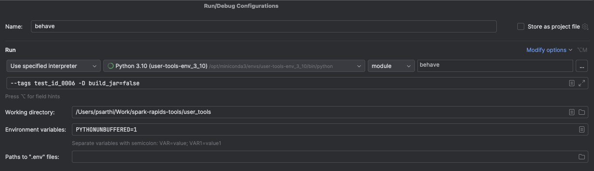

# Spark Rapids Tools End-to-End Behavior Tests

This document outlines the end-to-end tests for Spark Rapids tools, designed to cover scenarios such as missing
dependencies, handling different types of event logs, and interacting with HDFS.

## Directory Structure
```commandline
user_tools/tests/spark_rapids_tools_e2e/
├── behave.ini                      # Configuration file for the `behave` test runner.
├── features                        # Contains test scenarios and environment setup.
│  ├── environment.py               # Setup and teardown procedures for the tests.
│  ├── steps                        # Step definitions for the tests.
│  └── *.feature                    # Feature files defining test scenarios.
└── resources                       # Resources used in the tests.
    ├── event_logs  
    └── scripts                     # Scripts used in the tests.  
```


## Setup

From the `<repo_root>/user_tools` directory, run the following command to install the required dependencies:


```sh
pip install behave
# or
pip install .[test]
```


## Running Tests
Tests can be run using 'behave' cmd or using 'tox' cmd.

**Basic Usage:**

```sh
behave <options>
# or
tox -e behave -- <options>
```

**Run All Tests:**

```sh
behave
# or
tox -e behave
```

### Common Options

**Run Specific Tests by Tag**

See the [Tags Format](#tags-format) section for more information on tags.

```sh
behave --tags <tag>
# or
tox -e behave -- --tags <tag>
```

**Run Specific Tests by Name**

```sh
behave --name <scenario_name>
# or
tox -e behave -- --name <scenario_name>
```

**Skip Tests by Tag**

```sh
behave --tags ~<tag>
# or
tox -e behave -- --tags ~<tag>
```

**Custom Arguments**
- Custom arguments can be passed to the behave tests using the `-D` flag.
- Example: Skip building the Tools jar during setup.

```sh
behave -D build_jar=false   # Skip building the Tools jar during setup (default: true)
# or
tox -e behave -- -D build_jar=false
```


## Notes

### Tags Format
Tags are used to uniquely identify test scenarios and are defined in the following format: `@test_id_<feature>_<00xx>`.
- `<feature>`: Acronym for the feature file being tested. Examples:
   - `ELP` for `event_log_processing.feature`
   - `IC` for `installation_checks.feature`
- `<00xx>`: Unique 4-digit identifier for the test scenario. Examples: `0001`, `0002`.

Tags Example: `@test_id_ELP_0001`, `@test_id_IC_0002`.

### Built-in Setup Steps

The tests include the following setup steps:

1. Build Spark Rapids Tools JAR:
    - By default, the JAR is built before running the tests.
    - To skip this step (e.g., if the JAR is already built), use the argument -D build_jar=false.
2. Build the Python Package.

The test warns the user that initial setup may take a few minutes.

### Built-in HDFS Cluster Setup

- Some of the tests include configuring a local HDFS cluster. Step: `HDFS is "{status}"`
- This step downloads Hadoop binaries and sets up the cluster.
  - The download occurs only once per machine but cluster setup is done for each test run.
  - Download step may take a few minutes.
- Tests involving HDFS are tagged with `@long_running` and can be skipped using `--tags ~@long_running`

#### Cleanup
- Step `HDFS is "{status}"` sets an after scenario hook to stop up the HDFS cluster and remove the temporary directories.
- It does not clean up the Hadoop binaries downloaded during the setup.
- Cleanup can be done manually using the below script:
```sh
<repo_root>/user_tools/tests/spark_rapids_tools_e2e/resources/scripts/hdfs/cleanup_hdfs.sh
```  

## Debugging Tests in IDE:

- Ensure the Python interpreter is set to the correct virtual environment and `JAVA_HOME` is set.

**IntelliJ**
- Add a Python run configuration with module name: `behave` and working directory: `<repo-root>/user_tools`.
- Add required arguments in `Script parameters` field.

Sample Run Configuration:


**VS Code**
- Open or create the `.vscode/launch.json` file. Add the following configuration with required arguments:
```json
{
    "configurations": [
        {
            "name": "Python: Spark Rapids Tools E2E Tests",
            "type": "debugpy",
            "request": "launch",
            "module": "behave",
            "args": [],  
            "python": "${command:python.interpreterPath}",
            "cwd": "${workspaceFolder}/user_tools"
        }
    ]
}
```


## Guidelines for Writing Tests

TODO: Add guidelines and conventions for writing tests.
